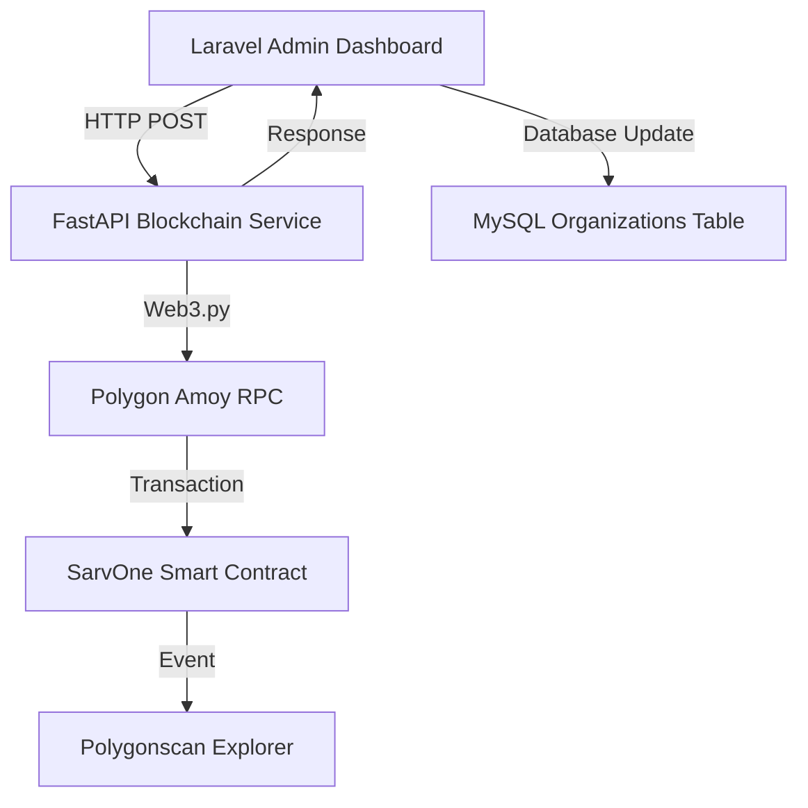

# 🚀 SarvOne FastAPI Blockchain Service Setup

Complete setup guide for integrating the FastAPI blockchain microservice with Laravel SarvOne application.

## 📋 Quick Setup Steps

### 1. Setup FastAPI Blockchain Service

```bash
# Navigate to blockchain service directory
cd fastapi_blockchain_service

# Create virtual environment
python -m venv blockchain_env

# Activate virtual environment (Windows)
blockchain_env\Scripts\activate

# Install dependencies
pip install -r requirements.txt

# Setup environment
cp env_example.txt .env
# Edit .env with your actual values
```

### 2. Configure Environment Variables

Create `.env` file in `fastapi_blockchain_service/` directory:

```env
# Blockchain Configuration
BLOCKCHAIN_RPC_URL=https://rpc-amoy.polygon.technology
BLOCKCHAIN_RPC_FALLBACK_URL=https://young-indulgent-patron.matic-amoy.quiknode.pro/4e4a6988984084051912a9832446801add7dffaf/

# Smart Contract Configuration
CONTRACT_ADDRESS=0x959387840a40b3bc065033a5da73c75C42c46919
CONTRACT_ABI_FILE=SarvOneABI.json

# Admin Account (Government Approval Authority)
ADMIN_PRIVATE_KEY=6001d9f1d7816625adbef25129e435495286ec2ed79f5e63540888789abb4aa5

# Network Configuration
CHAIN_ID=80002
GAS_LIMIT=200000
GAS_PRICE_GWEI=30

# Explorer Configuration
EXPLORER_URL=https://amoy.polygonscan.com/tx/

# Service Configuration
API_HOST=0.0.0.0
API_PORT=8001
```

### 3. Update Laravel Configuration

Add to Laravel `.env`:
```env
BLOCKCHAIN_SERVICE_URL=http://localhost:8001
BLOCKCHAIN_SERVICE_TIMEOUT=30
```

### 4. Start the Services

**Terminal 1 - FastAPI Blockchain Service:**
```bash
cd fastapi_blockchain_service
blockchain_env\Scripts\activate  # Windows
python run.py
```

**Terminal 2 - Laravel Application:**
```bash
php artisan serve
```

### 5. Test the Integration

```bash
# Test FastAPI service
cd fastapi_blockchain_service
python test_service.py

# Test Laravel admin approval
# Go to: http://localhost:8000/gov/approval
# Try approving an organization
```

## 🔧 Architecture Overview



## 📡 API Integration Points

### Laravel Admin Controller → FastAPI Service

**Request:**
```php
$response = Http::timeout(30)
    ->post('http://localhost:8001/approve_org', [
        'orgDID' => 'did:sarvone:sbi:00001',
        'orgAddress' => '0xAbc123...',
        'scopes' => ['kyc_verification', 'loan_approval']
    ]);
```

**Response:**
```json
{
  "success": true,
  "tx_hash": "0xabcdef1234567890...",
  "explorer_url": "https://amoy.polygonscan.com/tx/0xabcdef1234567890...",
  "timestamp": "2025-01-28T12:00:00.000Z"
}
```

### FastAPI Service → Polygon Blockchain

**Smart Contract Call:**
```python
contract.functions.approveOrganization(
    orgDID,           # "did:sarvone:sbi:00001"
    orgAddress,       # "0xAbc123..."
    scopes           # ["kyc_verification", "loan_approval"]
).buildTransaction({...})
```

## 🔒 Security Features

- ✅ **Private Key Security**: Admin key stored in environment variables
- ✅ **Input Validation**: Pydantic models validate all inputs
- ✅ **Error Handling**: Comprehensive error messages and logging
- ✅ **Address Validation**: Ethereum address format validation
- ✅ **DID Validation**: SarvOne DID format validation
- ✅ **Timeout Protection**: HTTP timeouts prevent hanging requests
- ✅ **Gas Management**: Balance checks before transactions

## 📊 Monitoring & Logging

### FastAPI Service Logs
- File: `fastapi_blockchain_service/blockchain_service.log`
- Console output with timestamps
- Request/response logging
- Error tracking with stack traces

### Laravel Logs
- File: `storage/logs/laravel.log`
- Organization approval events
- Blockchain service call results
- Error handling and debugging

### Health Monitoring
```bash
# Check FastAPI service health
curl http://localhost:8001/health

# Check contract info
curl http://localhost:8001/contract/info
```

## 🧪 Testing Checklist

- [ ] FastAPI service starts without errors
- [ ] Health check endpoint responds
- [ ] Contract info endpoint works
- [ ] Input validation working (test invalid addresses/DIDs)
- [ ] Laravel can call FastAPI service
- [ ] Admin approval updates database with transaction hash
- [ ] Transaction hash links work on Polygonscan
- [ ] Error handling works for failed transactions

## 🚨 Troubleshooting

### Common Issues

1. **"Connection Refused"**
   - Check if FastAPI service is running on port 8001
   - Verify `BLOCKCHAIN_SERVICE_URL` in Laravel .env

2. **"Insufficient Funds"**
   - Admin account needs MATIC for gas fees
   - Check balance: Go to health endpoint

3. **"Contract Logic Error"**
   - Verify contract address is correct
   - Check if admin is authorized on contract
   - Ensure organization isn't already approved

4. **"RPC Error"**
   - Try fallback RPC URL
   - Check network connectivity
   - Verify Polygon Amoy is accessible

### Debug Commands

```bash
# Check FastAPI service logs
tail -f fastapi_blockchain_service/blockchain_service.log

# Test individual endpoints
curl http://localhost:8001/health
curl http://localhost:8001/contract/info

# Check Laravel logs
tail -f storage/logs/laravel.log

# Test admin account balance
# Go to: https://amoy.polygonscan.com/address/YOUR_ADMIN_ADDRESS
```

## 🔄 Production Deployment

### FastAPI Service
1. Use production WSGI server (gunicorn)
2. Configure SSL/TLS
3. Set up reverse proxy (nginx)
4. Use systemd for process management
5. Configure log rotation
6. Set up monitoring (Prometheus/Grafana)

### Laravel Application
1. Update `BLOCKCHAIN_SERVICE_URL` to production URL
2. Configure proper timeouts
3. Set up retry logic for failed requests
4. Add circuit breaker for service failures
5. Monitor blockchain service health

### Security Hardening
1. Use dedicated admin account with minimal permissions
2. Rotate private keys regularly
3. Implement API authentication
4. Use VPN/private networks
5. Monitor transaction patterns
6. Set up alerting for failures

## 📈 Performance Optimization

- **Connection Pooling**: Reuse HTTP connections
- **Caching**: Cache contract ABI and configuration
- **Async Processing**: Use Laravel jobs for blockchain calls
- **Rate Limiting**: Prevent spam transactions
- **Load Balancing**: Multiple FastAPI instances

## 🎯 Success Metrics

- ✅ Organization approval latency < 30 seconds
- ✅ 99.9% blockchain service uptime
- ✅ Zero failed transactions due to service errors
- ✅ All transactions visible on Polygonscan
- ✅ Error rate < 1%

---

**🎉 Your SarvOne blockchain integration is now complete!**

The FastAPI microservice provides a robust, scalable solution for blockchain operations while keeping the Laravel application focused on business logic and user interface. 